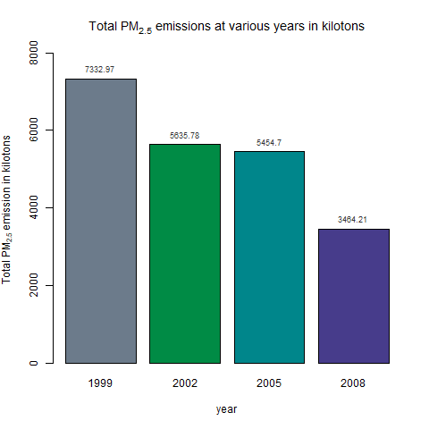
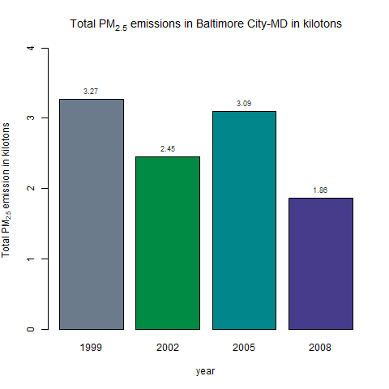
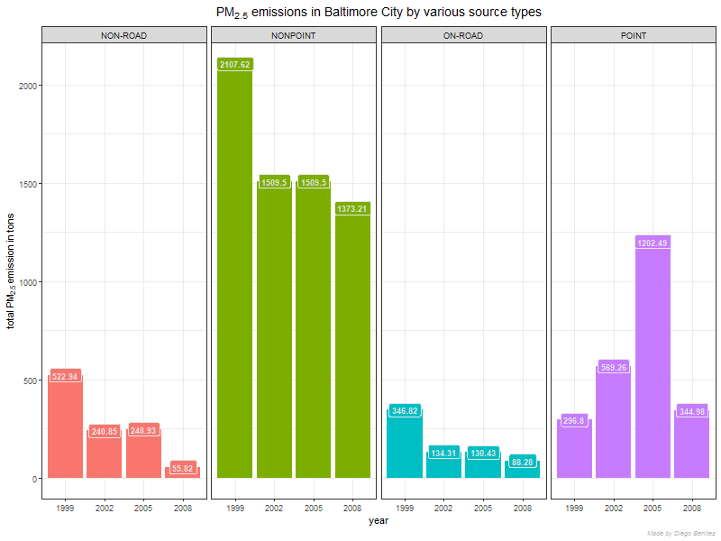
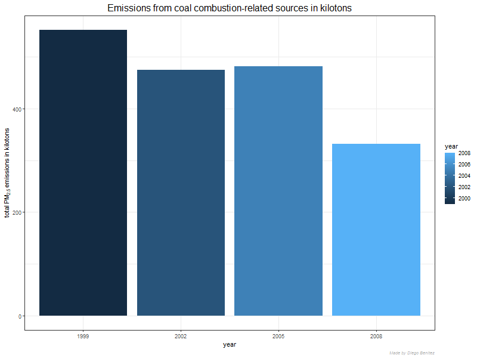
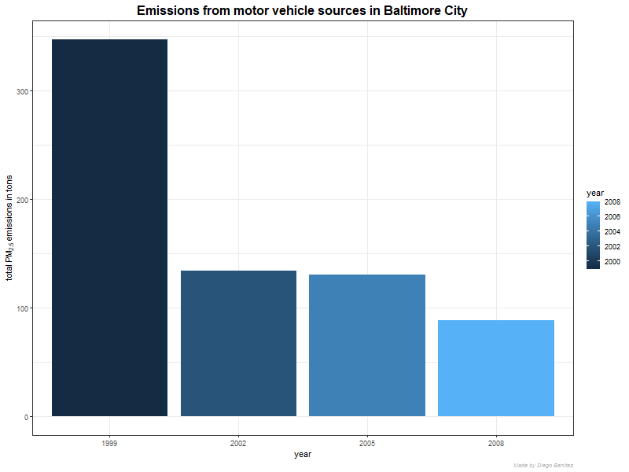
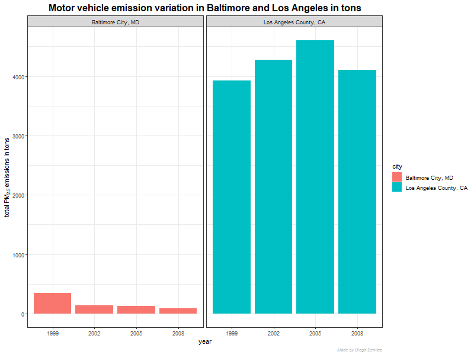

Exploratory Data Analysis - Course Project 2
============================================
_A final course project of coursera Exploratory Data Analysis_

**NOTE: My answers to the questions are at the end of this document, and that is included in an individual R code file with its respective image separately.**

# Introduction

Fine particulate matter (PM2.5) is an ambient air pollutant for which there is strong evidence that it is harmful to human health. In the United States, the Environmental Protection Agency (EPA) is tasked with setting national ambient air quality standards for fine PM and for tracking the emissions of this pollutant into the atmosphere. Approximatly every 3 years, the EPA releases its database on emissions of PM2.5. This database is known as the National Emissions Inventory (NEI). You can read more information about the NEI at the EPA National [Emissions Inventory web site](http://www.epa.gov/ttn/chief/eiinformation.html).

For each year and for each type of PM source, the NEI records how many tons of PM2.5 were emitted from that source over the course of the entire year. The data that you will use for this assignment are for 1999, 2002, 2005, and 2008.

# Data

The data for this assignment are available from the course web site as a single zip file:

* [Data for Peer Assessment [29Mb]](https://d396qusza40orc.cloudfront.net/exdata%2Fdata%2FNEI_data.zip)

The zip file contains two files:

PM2.5 Emissions Data (`summarySCC_PM25.rds`): This file contains a data frame with all of the PM2.5 emissions data for 1999, 2002, 2005, and 2008. For each year, the table contains number of tons of PM2.5 emitted from a specific type of source for the entire year. Here are the first few rows.
````
##     fips      SCC Pollutant Emissions  type year
## 4  09001 10100401  PM25-PRI    15.714 POINT 1999
## 8  09001 10100404  PM25-PRI   234.178 POINT 1999
## 12 09001 10100501  PM25-PRI     0.128 POINT 1999
## 16 09001 10200401  PM25-PRI     2.036 POINT 1999
## 20 09001 10200504  PM25-PRI     0.388 POINT 1999
## 24 09001 10200602  PM25-PRI     1.490 POINT 1999
````

* `fips`: A five-digit number (represented as a string) indicating the U.S. county
* `SCC`: The name of the source as indicated by a digit string (see source code classification table)
* `Pollutant`: A string indicating the pollutant
* `Emissions`: Amount of PM2.5 emitted, in tons
* `type`: The type of source (point, non-point, on-road, or non-road)
* `year`: The year of emissions recorded

Source Classification Code Table (`Source_Classification_Code.rds`): This table provides a mapping from the SCC digit strings int he Emissions table to the actual name of the PM2.5 source. The sources are categorized in a few different ways from more general to more specific and you may choose to explore whatever categories you think are most useful. For example, source “10100101” is known as “Ext Comb /Electric Gen /Anthracite Coal /Pulverized Coal”.

You can read each of the two files using the `readRDS()` function in R. For example, reading in each file can be done with the following code:

````
## This first line will likely take a few seconds. Be patient!
NEI <- readRDS("summarySCC_PM25.rds")
SCC <- readRDS("Source_Classification_Code.rds")
````

as long as each of those files is in your current working directory (check by calling `dir()` and see if those files are in the listing).

# Assignment

The overall goal of this assignment is to explore the National Emissions Inventory database and see what it say about fine particulate matter pollution in the United states over the 10-year period 1999–2008. You may use any R package you want to support your analysis.

## Making and Submitting Plots

For each plot you should

* Construct the plot and save it to a PNG file.
* Create a separate R code file (plot1.R, plot2.R, etc.) that constructs the corresponding plot, i.e. code in plot1.R constructs the plot1.png plot. Your code file should include code for reading the data so that the plot can be fully reproduced. You should also include the code that creates the PNG file. Only include the code for a single plot (i.e. plot1.R should only include code for producing plot1.png)
* Upload the PNG file on the Assignment submission page
* Copy and paste the R code from the corresponding R file into the text box at the appropriate point in the peer assessment.

In preparation we first ensure the data sets archive is downloaded and extracted.

```{r setup,echo=FALSE}
# Download the file source
if(!file.exists("./data")){dir.create("./data")}
getData <- "https://d396qusza40orc.cloudfront.net/exdata%2Fdata%2FNEI_data.zip"
download.file(getData, "./data/NEI-data.zip", method = "curl")
unzip("./data/NEI-data.zip", exdir = "./data")
list.files("./data")
```

We now load the NEI and SCC data frames from the .rds files.

```{r data, cache=TRUE}
# Read the National Emissions Data
NEI <- readRDS("./data/summarySCC_PM25.rds")
# Read source code classication data
SCC <- readRDS("./data/Source_Classification_Code.rds")
```

And charge the mandatory libraries for this process

```{r setup,echo=FALSE}
library(dplyr)
library(ggplot2)
library(knitr)  # Only for print tables
```

## Questions

You must address the following questions and tasks in your exploratory analysis. For each question/task you will need to make a single plot. Unless specified, you can use any plotting system in R to make your plot.

### Question 1

First we'll aggregate the total PM2.5 emission from all sources for each of the years 1999, 2002, 2005, and 2008.

```{r aggregate, cache=TRUE}
# Output table for Total emissions per year
NEI %>% group_by(year) %>% summarise(Emissions = sum(Emissions)) %>% kable()
```

Using the **base** plotting system, now we plot the total PM2.5 Emission from all sources,

```{r plot1}
# Generating the plot 1 (p1)
png("./data/plot1.png", width=480, height=480, units="px")
total <- NEI %>% group_by(year) %>% summarise(emissions = sum(Emissions)) 
colores <- c("slategray4", "springgreen4", "turquoise4", "slateblue4")
p1 <- barplot(height = total$emissions/1000, 
              names.arg = total$year,
              main = expression('Total PM'[2.5]*
                                    ' emissions at various years in kilotons'),
              xlab = "year",
              ylab = expression('Total PM'[2.5]*' emission in kilotons'),
              ylim = c(0, 8000), 
              col = colores)
text(x = p1, y = round(total$emissions/1000, 2), pos =3, cex = 0.75, col = "gray20",
     label = round(total$emissions/1000, 2))
dev.off()
```
**Have total emissions from PM2.5 decreased in the United States from 1999 to 2008?**

As we can see from the plot, total emissions have decreased in the US from 1999 to 2008.



### Question 2

First we aggregate total emissions from PM2.5 for Baltimore City, Maryland (fips = "24510") from 1999 to 2008.

```{r BaltimoreNEI,cache=TRUE}
BaltimoreNEI <- NEI %>% filter(fips == "24510") %>% group_by(year) %>%
    summarise(Emissions = sum(Emissions))
BaltimoreNEI %>% kable()  #Print the table of emissions per year
```

Now we use the base plotting system to make a plot of this data,

```{r plot2}
colores <- c("slategray4", "springgreen4", "turquoise4", "slateblue4")  # Colors in R-plot
png("./data/plot2.png", width=480, height=480, units="px")
p2 <- barplot(height = BaltimoreNEI$Emissions/1000, 
              names.arg = BaltimoreNEI$year,
              main = expression('Total PM'[2.5]*
                                    ' emissions in Baltimore City-MD in kilotons'),
              xlab = "year",
              ylab = expression('Total PM'[2.5]*' emission in kilotons'),
              ylim = c(0, 4),
              col = colores)
text(x = p2, y = round(BaltimoreNEI$Emissions/1000, 2), pos =3, cex = 0.75, 
     col = "gray20", label = round(BaltimoreNEI$Emissions/1000, 2))
dev.off()
```

**Have total emissions from PM2.5 decreased in the Baltimore City, Maryland (fips == "24510") from 1999 to 2008?**

Overall total emissions from PM2.5 have decreased in Baltimore City, Maryland from 1999 to 2008.



### Question 3

Subsetting the database

```{r BaltimoreNEI-, cache=TRUE}
BaltimoreNEI <- NEI %>% filter(fips == "24510") %>% group_by(year, type) %>%
    summarise(Emissions = sum(Emissions))
BaltimoreNEI %>% kable()
```

Using the ggplot2 plotting system,

```{r plot3}
png("./data/plot3.png", width=800, height=600, units="px")
BaltimoreNEI %>% ggplot(aes(factor(year), Emissions, fill = type,
                            label = round(Emissions, 2))) +
    geom_bar(stat = "identity") +
    facet_grid(.~type) + 
    geom_label(aes(fill = type), color = "gray90", fontface = "bold", size = 3) +
    theme_bw() +
    labs(x = "year",
         y = expression("total PM"[2.5]*" emission in tons"),
         title = expression("PM"[2.5]*paste(" emissions in Baltimore ",
                                    "City by various source types", sep="")),
         caption = "Made by Diego Benitez") +
    theme(plot.title = element_text(hjust = 0.5, size =  14, face = "bold"),
          plot.caption = element_text(hjust = 1, face = "italic", 
                                      color = "gray70", size = 7),
          legend.position = "none")
dev.off()
```

**Of the four types of sources indicated by the type (point, nonpoint, onroad, nonroad) variable, which of these four sources have seen decreases in emissions from 1999–2008 for Baltimore City?**

The `non-road`, `nonpoint`, `on-road` source types have all seen decreased emissions overall from 1999-2008 in Baltimore City.

**Which have seen increases in emissions from 1999–2008?**

The `point` source saw a slight increase overall from 1999-2008. Also note that the `point` source saw a significant increase until 2005 at which point it decreases again by 2008 to just above the starting values. 



### Question 4

First we subset coal combustion source factors NEI data.

```{r combustion,cache=TRUE}
# Subset coal combustion related NEI data
coalCombustion <- (grepl("comb", SCC$SCC.Level.One, ignore.case = TRUE) & 
                       grepl("coal", SCC$SCC.Level.Four, ignore.case = TRUE))
combustionSCC <- SCC[coalCombustion, ]$SCC
combustionNEI <- NEI[NEI$SCC %in% combustionSCC, ]
```

Note:  The SCC levels go from generic to specific. We assume that coal combustion related SCC records are those where SCC.Level.One contains the substring 'comb' and SCC.Level.Four contains the substring 'coal'.

```{r plot4}
png("./data/plot4.png", width=800, height=600, units="px")
combustionNEI %>% ggplot(aes(factor(year), Emissions/1000, fill = year)) +
    geom_bar(stat = "identity") + 
    theme_bw() +
    labs(x = "year",
         y = expression("total PM"[2.5]*" emissions in kilotons"),
         title = expression("Emissions from coal combustion-related sources in kilotons"),
         caption = "Made by Diego Benitez") +
    theme(plot.title = element_text(hjust = 0.5, size =  16, face = "bold"),
          plot.caption = element_text(hjust = 1, face = "italic", 
                                      color = "gray70", size = 7))
dev.off()
```

**Across the United States, how have emissions from coal combustion-related sources changed from 1999–2008?**

Emissions from coal combustion related sources have decreased from 6 * 10^6 to below 4 * 10^6 from 1999-2008.

Eg. Emissions from coal combustion related sources have decreased by about 1/3 from 1999-2008!



### Question 5

First we subset the motor vehicles, which we assume is anything like Motor Vehicle, we subset for motor 
vehicles in Baltimore,

```{r BaltCity,cache=TRUE}
BaltCity <- NEI[(NEI$fips == "24510") & (NEI$type == "ON-ROAD"), ]
```

Finally we plot using ggplot2,

```{r plot5}
png("./data/plot5.png", width=800, height=600, units="px")
BaltCity %>% group_by(year) %>% summarise(Emissions = sum(Emissions)) %>%
    ggplot(aes(factor(year), Emissions, fill = year)) +
    geom_bar(stat = "identity") +
    theme_bw() +
    labs(x = "year",
         y = expression("total PM"[2.5]*" emissions in tons"),
         title = "Emissions from motor vehicle sources in Baltimore City",
         caption = "Made by Diego Benitez") +
    theme(plot.title = element_text(hjust = 0.5, size =  16, face = "bold"),
          plot.caption = element_text(hjust = 1, face = "italic", 
                                      color = "gray70", size = 7))
dev.off()
```


**How have emissions from motor vehicle sources changed from 1999–2008 in Baltimore City?**

Emissions from motor vehicle sources have dropped from 1999-2008 in Baltimore City!

### Question 6

Comparing emissions from motor vehicle sources in Baltimore City (fips == "24510") with emissions from motor vehicle sources in Los Angeles County, California (fips == "06037"),

```{r BaltCityEmis,cache=TRUE}
BaltCityEmis <- NEI %>% filter(fips == "24510" & type == "ON-ROAD") %>%
    group_by(year) %>% summarise(Emissions = sum(Emissions))
BaltCityEmis$city <- "Baltimore City, MD"
LosAngelesEmis <- NEI %>% filter(fips == "06037" & type == "ON-ROAD") %>%
    group_by(year) %>% summarise(Emissions = sum(Emissions))
LosAngelesEmis$city <- "Los Angeles County, CA"
both <- rbind(BaltCityEmis, LosAngelesEmis)
```

Now we plot using the ggplot2 system,

```{r plot6}
png("./data/plot6.png", width=800, height=600, units="px")
both %>% ggplot(aes(factor(year), Emissions, fill = city)) + 
    geom_bar(stat = "identity") +
    facet_grid(.~city, scales = "free") +
    theme_bw() +
    labs(x = "year",
         y = expression("total PM"[2.5]*" emissions in tons"),
         title = "Motor vehicle emission variation in Baltimore and Los Angeles in tons",
         caption = "Made by Diego Benitez") +
    theme(plot.title = element_text(hjust = 0.5, size =  16, face = "bold"),
          plot.caption = element_text(hjust = 1, face = "italic", 
                                      color = "gray70", size = 7))
dev.off()
```

**Which city has seen greater changes over time in motor vehicle emissions?**

Los Angeles County has seen the greatest changes over time in motor vehicle emissions.


